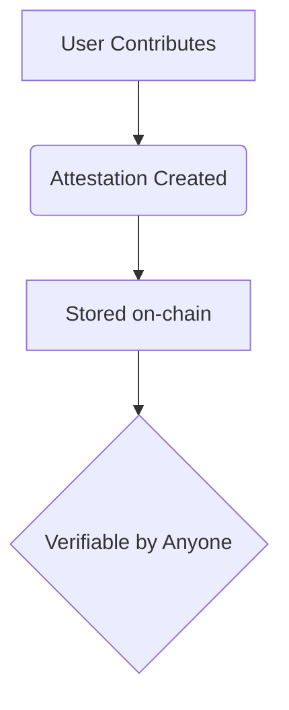

layout: docs
title: About OTTP
description: Open to the Public (OTTP) is an open protocol for co-creating, attesting to, and owning your collaboration graph.
tableOfContents: true
outline: deep
pagination: true
---

# About OTTP

## What Is OTTP?

Open to the Public (OTTP) is an open protocol for co-creating, attesting to, and owning your collaboration graph. Think of it as a public space where anyone can:

- 🔍 **Browse** existing projects
- ✍️ **Contribute** work
- 🚀 **Create** new initiatives

All while establishing verified records of who did what and with whom.

## Why Use OTTP?

### Key Benefits
| Current Problem | OTTP Solution |
|----------------|--------------|
| Platform lock-in (LinkedIn/GitHub) | **Portable contributions** |
| Self-reported credentials | **Collaborator-verified proof** |
| Centralized control | **Self-custodial ownership** |

### For Different Users
- **Developers**: Build on a decentralized contribution graph
- **Creators**: Get verifiable credit for collaborative work
- **Organizations**: Manage open projects with transparent attribution

## How It Works



1. **Attestations**  
   - Standardized proofs via EAS schemas
   - Immutable record of contributions

2. **Identity**  
   - Works with ENS, Farcaster, and crypto wallets
   - Recoverable even if you lose access

3. **Extensibility**  
   - Open schema system
   - Supports plugins for new use cases

## Getting Started

### Quick Actions
| Action | Where |
|--------|-------|
| Browse projects | [OTTP Explorer](#) |
| Make first contribution | [Frame](#) / [Web](#) |
| Create project | [Builder Dashboard](#) |

## Roadmap

### ✅ V1 (Complete)
- Core smart contracts
- Basic SDK
- Farcaster integration

### 🚧 V2 (In Progress)
- [ ] Open-source frontend
- [ ] Enhanced contribution types
- [ ] Multi-chain support

---

> "OTTP returns control of your collaboration history to you."  
> – Project Manifesto
```

